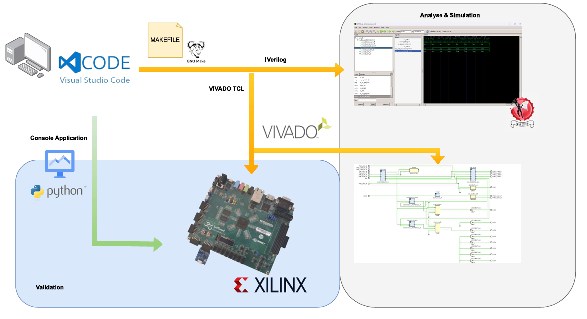

# LVDS - Transceiver

Dieses Dokument beschreibt grundlegende Informationen zum entwickelten Transceiver. Zwei Transceiver werden zusammen mit einer Testschaltung auf einem Zynq7000 synthesiert. Dabei wird der zweite Transceiver B (Sink) mit dem ersten Transceiver A (Source) synchronisiert. Die Testschaltung (Testcore) erlaubt das Transferieren von Datenpacketen zwischen den Transceivern. Das Steuern und Auswerten (Monitoring) erfolgt mittels Python - Skript, welcher Steuer - und Datenbytes an den Testcore mittels UART überträgt. Der Transceiver ist in der Lage Transaction - Layerpackete (TLP) sicher zu übertragen.  
## Abstract

Dieses Projekt beinhaltet Hardwarebeschreibungen (Verilog) zur Synthese eines Transceivers, welcher für das Zynq7000 - Boards entwickelt wurde. Die serielle Datenübertragung erreicht durch die Nutzung der IOSerDes - und IDelaye Primitiven die Chip-spezifische Maximaldatenrate.

### Spezifikationen
- Datenrate  von 1200Mbit/s (DDR bei 600MHz)
- Gleichstromfreie Datenübertragung durch Anwendung einer 8B10B - Kodierung
- Datenprüfung mittels CRC-8
- Ack/Nack - Mechanismus
- Bit Deskew
- Optimiertes Senden durch direkte Verkettung anliegender Daten
- Variable Datenbereite für parallele Datenübergabe (TLP) 

## Kompilieren

Das Repository beinhaltet ein Makefile zum kompilieren der Hardwarebeschreibungen für Simulation und Zielhardware. Die entwickelten Module sind in Ordnerstrukturen organsisiert. Die make - Anweisungen werden jeweils auf den Modulordner referenziert.   

### Anweisungen
- Kompilieren mit IVerilog => mingw32-make "Modul"
- Ausführen der Simulation (Testbench + GTK Wave) => mingw32-make wave "Modul"
- Build für Xilinx Zynq7000 (Ausführen build.tcl) => mingw32-make build
- Laden des Zynq7000 (Ausführen prog.tcl) => mingw32-make prog  

## Takt - Verteilung
Die Taktversorgung der physikalischen Schnittstelle ist ein extern zugeführter 600 MHz Takt über MMCM (Source) oder Taktleitung (Sink). Die Taktpufferung, repsektive Teilung erfolgt mit BUFIO (Direkte Taktversorgung IO - Primitiven) und BUFR (Regional). Der Link - Layer wird jeweils über globale Taktbuffer (BUFG) vom MMCM versorgt. Das Testsystem wird ebenfalls global über einen PLL in einer weiteren Taktdomäne versorgt. 

### Auflistung Taktversorgung
- Testcore => PLL 166 MHZ (BUFG)
- Transceiver - Link Layer => MMCM 120 MHZ (BUFG)
- Transceiver - Physical Layer => 600 MHZ (BUFIO) , 200 MHZ (BUFR), 120 MHZ (BUFR)

Die Taktquelle ist der Onboard - Clock des FPGA (GCLK), welcher direkt dem PLL zugeführt wird. Der MMCM wird vom PLL mit einem generierten 50 MHz Takt über LVDS versorgt. (Port FMC_CLKx)

## Funktionsweise Link - Layer
Der Link - Layer wird unterteilt in einen Datengenerator und einem Datenprüfer. Der Generator baut die nachfolgend beschriebene Framestruktur auf welche Byteweise an den physikalischen - Layer übergeben wird. Die Prüfschaltung kontrolliert empfangenen Byte-Packete und stellt die Dateninformation zur Abholung durch den Transaction - Layer bereit.   

### DLLP (Data Link Layer Packet) - Frame
Wird für die Link - Kommunikation zwischen zwei Transceivern verwendet. Die Sender, respektive Empfängerlogik erlaubt eine variable Datenbreite. Für den aktuell vorliegenden Link - Controller ist eine breite von 16 Bit festgelegt.

### TLP - Frame

### Sender (Packet Generator) 

Für den Verbindungsaufbau muss das Stecker-Icon rechts neben der Überschrift gedrückt werden. Bei erfolgreichem Kommunikationsaufbau wird die Steckverbindung symbolisch geschlossen und mit einer grünen Umrandung signalisiert. Sollte die Kommunikation Systemseitig unterbrochen werden, so stellt sich ein roter Hintergrund ein. Die Kommunikation kann jederzeit durch ancklicken

### Empfänger (Packet Checker)

Dieses Benutzerpanel dient zum Test und Überwachen des Datentransfers über die Uart Schnittstelle. Durch drücken des Tasters "Test" wird ein zufälliges Byte erzeugt, welches vom Test-Core zurückgeschickt wird. Ein passender Vergleich bestätigt die Verbindung, welche am Textfeld ausgegeben wird. Das LOG-Fenster protokolliert alle Transferaufträge mit Datum und Uhrzeit. 

### Link - Manager

## Funktionsweise Physical - Layer

### SerDes

### Gearbox

### Wortausrichtung

### Initiale Tab - Kalibration

### Überwachung der 

## Testsystem (Test - Core)

### Architektur

## Test und Validierung

### Hardware

### Testbench

### Python

## Offene Punkte

