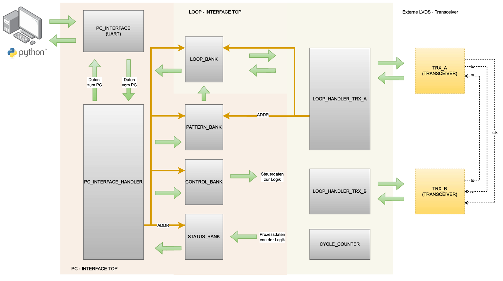

# LVDS - Transceiver

Dieses Dokument beschreibt grundlegende Informationen zum entwickelten Transceiver. Zwei Transceiver werden zusammen mit einer Testschaltung auf einem Zynq7000 synthesiert. Dabei wird der zweite Transceiver B (Sink) mit dem ersten Transceiver A (Source) synchronisiert. Die Testschaltung (Testcore) erlaubt das Transferieren von Datenpacketen zwischen den Transceivern. Das Steuern und Auswerten (Monitoring) erfolgt mittels Python - Skript, welcher Steuer - und Datenbytes an den Testcore mittels UART überträgt. Der Transceiver ist in der Lage Transaction - Layerpackete (TLP) sicher zu übertragen.  
## Abstract

Dieses Projekt beinhaltet Hardwarebeschreibungen (Verilog) zur Synthese eines Transceivers, welcher für das Zynq7000 - Boards entwickelt wurde. Die serielle Datenübertragung erreicht durch die Nutzung der IOSerDes - und IDelaye Primitiven die Chip-spezifische Maximaldatenrate.

### Spezifikationen
- Datenrate  von 1200Mbit/s (DDR bei 600MHz)
- Gleichstromfreie Datenübertragung durch Anwendung einer 8B10B - Kodierung
- Datenprüfung mittels CRC-8
- Ack/Nack - Mechanismus
- Bit Deskew
- Optimiertes Senden durch direkte Verkettung anliegender Daten
- Variable Datenbereite für parallele Datenübergabe (TLP) 

## Kompilieren

Das Repository beinhaltet ein Makefile zum kompilieren der Hardwarebeschreibungen für Simulation und Zielhardware. Die entwickelten Module sind in Ordnerstrukturen organsisiert. Die make - Anweisungen werden jeweils auf den Modulordner referenziert.   
 => mingw32-make wave "Modul"
- Build für Xilinx Zynq7000 (Ausführen build.tcl) => mingw32-make build
- Laden des Zynq7000 (Ausführen prog.tcl) => mingw32-make prog  

## Takt - Verteilung
Die Taktversorgung der physikalischen Schnittstelle ist ein extern zugeführter 600 MHz Takt über MMCM (Source) oder Taktleitung (Sink). Die Taktpufferung, repsektive Teilung erfolgt mit BUFIO (Direkte Taktversorgung IO - Primitiven) und BUFR (Regional). Der Link - Layer wird jeweils über globale Taktbuffer (BUFG) vom MMCM versorgt. Das Testsystem wird ebenfalls global über einen PLL in einer weiteren Taktdomäne versorgt. 

### Auflistung Taktversorgung
- Testcore => PLL 166 MHZ (BUFG)
- Transceiver - Link Layer => MMCM 120 MHZ (BUFG)
- Transceiver - Physical Layer => 600 MHZ (BUFIO) , 200 MHZ (BUFR), 120 MHZ (BUFR)

Die Taktquelle ist der Onboard - Clock des FPGA (GCLK), welcher direkt dem PLL zugeführt wird. Der MMCM wird vom PLL mit einem generierten 50 MHz Takt über LVDS versorgt. (Port FMC_CLKx)

### Elastic - Buffer
Die Datenübertragung von lokaler (BUFR) zur globalen (BUFG) Taktdomäne des Transceivers erfolgt über Elastische Buffer. Dieser ist in aktueller Ausführung aus einem Asynchronen FIFO mit Zusatzlogik für Lese- und Schreibbefehl zusammengebaut. Ziel des Buffers ist es, den Daten Füllstand mithilfe der Zu-, repsektive Abnahme von SKIP - Symbolen in der Mitte zu halten. Momentane implementierung nutzt nur SKIP - Symbole welche vom Packetgenerator am Ende einer Frameübertragung gesendet werden. Die Logik blockiert bei zu hohem Füllstand den Schreibzeiger wenn ein SKIP - Symbol am Eingang anliegt. Bei zu niedriegem Füllstand wird der Lesezeiger blockiert, wenn ein SKIP - Symbol am Ausgang anliegt. Diese Art der Implementierung erfordert eine dementsprechend grosse Speicherbreite, aufgrund fehlender SKIP - Symbolen bei übertragung längerer Nachrichten. Das führt zu hohen Latenzzeiten.

## Funktionsweise Link - Layer
Der Link - Layer wird unterteilt in einen Datengenerator und einem Datenprüfer. Der Generator baut die nachfolgend beschriebene Framestruktur auf welche Byteweise an den physikalischen - Layer übergeben wird. Die Prüfschaltung kontrolliert empfangenen Byte-Packete und stellt die Dateninformation zur Abholung durch den Transaction - Layer bereit.   
Der Datenrahmen wird mit K - Steuercodes der 8B10B - Kodierung bestimmt. 
- SLF (Start Link Frame) mit K28.0 (0x1C)
- SDF (Start Data Frame) mit K28.1 (0x3C)
- EOF (End of Frame) mit K28.2 (0x5C)
- SKP (Skip) mit K28.3 (0x7C)

Alle Frames werden zusammen mit einer Prüfsumme (CRC-8) gesendet, respektive validiert. Der Datentransfer erfolgt immer Byteweise. Datenbreiten die nicht dem Modulo 8 entsprechen, werden mit Zusatzbits erweitert, um eine Ganzzahlige Bytegrösse zu erreichen. (Datenbreite 34 Bits => 40 Bits) 

### DLLP (Data Link Layer Packet) - Frame
Wird für die Link - Kommunikation zwischen zwei Transceivern verwendet. Die Sender, respektive Empfängerlogik erlaubt eine variable Datenbreite. Für den aktuell vorliegenden Link - Controller ist eine breite von 16 Bit festgelegt.

Für die Zustandsübermittlung werden nur zwei Bits des MSB Bytes verwendet. Das LSB - Byte dient zur übermittlung der Identifikationsnummer zur Verifizierung (ACK). Die Zustandsbits (c) werden den nachfolgenden Nachrichten zugeordnet.  

- 00 => Empfang nicht bereit (Empfangspuffer voll)
- 01 => Empfang bereit
- 10 => Ungültige Daten empfangen (Nack)
- 11 => Daten erfolgreich erhalten (Ack)

### TLP - Frame
Das Transaction Layer Packet beinhaltet zusätzliche Kopfdaten mit Angabe der Anzahl und einer Identifikationsnummer. Die Breite der Kopfinformation ist abhängig vom Parameter ID_WIDTH. Standartmässig ist der Bereich der Identifikationsnummer auf 0 - 15 festgelegt. Das entspricht jeweils der gleichen Anzahl möglicher hintereinanderfolgender TLP - Packete (0 - 15).
Die Kopfdaten benötigen in diesem Fall nur 1 Byte (4Bit + 4 Bit). Identifikationsnummern im Bereich 0 - 31 würde zu einer Kopfdatenbreite von 2 Bytes führen (5Bit + 5Bit) 

Das Erhöhen des Nummernbereiches für die Identifikationsnummer macht dann Sinn, wenn der Sendepuffer jeweils immer mit mehr als 16 TLP - Packete nachgeladen wird. (Applikationsabhängig)

### Sender (Packet Generator) 
Der Packetgenerator wird zentral von einem Controller gesteuert. Dieser stellt die Weichen für den Datenfluss durch das steuern der Multiplexer. Zentral für die Funktionalität ist eine implementierte FIFO - Zeigerlogik für Bestätigte, respektive Fehlerhafte ID übertragungen im Controller. Das Senden von DLLP hat eine höhere Priorität als das Senden von TLP - Packeten. Der Transfer von TLP - Packeten muss vom Link - Manager freigegeben werden. (Erfolgt mit Steuerflags "Start" und "Stop")

Daten aus dem TLP - Buffer erhalten die jeweils nächste Verfügbare Identifikationsnummer des Zeigers für nicht bestätigter ID (NACK_PTR). Bei einer ID - Breichsbreite von 4 Bits können also maximal 16 TLP - Packete verschickt werden, bis ein weiteres Senden aufgrund fehlender Bestätigung blockiert wird. Kopfdatenzusammensetzung ist {Packet_Nummer, ID_Nummer}

Fallbeispiel 1:
- Im TLP Buffer liegt ein Datenpacket
- Die nächste ID ist 3
- Alle vorherigen Sendeaufträge sind bereits bestätigt

Die Kopfdaten des Transfers wären {4b0000, 4b0011} für 0 = 1 Datenpacket und ID 3. Der Zeiger für nicht bestätigte ID's wird um 1 erhöht. Neue Verfügbare Daten können sofort wieder gesendet werden.

Fallbeispiel 2:
- Im TLP Buffer liegen 4 Datenpackete
- Die nächste ID ist 3
- Alle vorherigen Sendeaufträge sind bereits bestätigt

Die Kopfdaten des Transfers wären {4b0011, 4b0011} für 3 = 4 Datenpacket und ID 3. Der Zeiger für nicht bestätigte ID's wird um 4 erhöht. Neue Verfügbare Daten können sofort wieder gesendet werden.

Fallbeispiel 3:
- Im TLP Buffer liegen 16 Datenpackete
- Die nächste ID ist 3
- Alle vorherigen Sendeaufträge sind bereits bestätigt

Die Kopfdaten des Transfers wären {4b1111, 4b0011} für 15 = 16 Datenpacket und ID 3. Der Zeiger für nicht bestätigte ID's wird um 16 erhöht. Neue Verfügbare Daten können nicht sofort wieder gesendet werden. Ein weiterer Transfer ist nur möglich, sobald mindestens eine Identifikationsnummer bestätigt wird. 

Fallbeispiel 4:
- Im TLP Buffer liegen 16 Datenpackete
- Die nächste ID ist 3
- Nicht alle vorherigen Sendeaufträge sind bestätigt

Die Kopfdaten des Transfers wären {4bxxxx, 4b0011} für xxxx = Soviele Datenpackete bis der Nack_Zeiger den Ack_Zeiger nicht überholt und ID 3.

### Replay Buffer
Das Schreiben in den Replay Buffer erfolgt mit der nicht bestätigten Identifikationsnummer. Die Speicherablage entspricht dem Identifikationsbereich. Das Widergeben gespeicherter Daten erfolgt mit dem Addresszeiger bestätigter ID's. Dieser wird während des Replay - Vorgangs auf den Wert der nicht bestätigten ID's inkrementiert. Ein Replay - Vorgang sendet also immer alle nicht bestätigten Datenpackete als "Multiframe".  

### Byte - Splitter
Die Byteweise Ausgabe, respektive das zerlegten von TLP und DLLP - Daten erfolgt mit einer Register - Multiplexer Pipeline Struktur. Die Zusammensetzung ergibt sich aus Parametrierter Datenlänge für TLP und DLLP Packeten. Solange Daten im TLP - Buffer verfügbar sind, wird dieser kontinuierlich nachgeladen, sofern der Identifikationszeiger dies zulässt.   

### Empfänger (Packet Checker)
Der Datenprüfer operiert ebenfalls mittels zentraler Steuerlogik. Eingehende DLLP und TLP's werden erkannt und nach erfolgreicher Datenprüfung (Frameaufbau, CRC) in die Empfangsbuffer geschrieben. Die Funktionalität der Steuereinheit in Bezug auf Auswertung von TLP's ist umfangreicher/koplexer als beim Packetgenerator. Aufgrund möglicher Multiframes müssen die TLP - Daten zwischengespeichert werden, bevor diese in die Endablage für den Zugriff des nächst höheren Layers geschrieben werden. TLP - Packete werden daher in zwei Prozessen geprüft. Im ersten werden TLP - Daten entsprechend der Parametrierten Datenlänge temporär abgelegt. Die Anzahl abgelegter Daten wird gezählt. Weiter werden die Transferinformationen mit Inhalt über Packetlänge und der Frameprüfung (CRC, Stop-Code) temporär abgelegt. (tr_info = {Gültigkeit (1Bit), Frame_Nummer (ID_WIDTH)}. Weiter werden die Kopfdaten des empfangenen TLP - Frames mitangefügt. Kopfdaten = {Frame_Nummer, Frame_ID} Das ergibt eine gesammte Prozessinformation von {Gültig, Frame_Nummer_Transfer, Frame_Nummer_Kopfdaten, ID_Nummer_Kopfdaten}
Basierend auf diesen Informationen werden die Temporären TLP - Daten in einem zweiten Prozess verworfen, oder übernommen. Die Ergebnisse aus dem zweiten Prüfprozess werden vom Link - Controller für den ACK/NACK Prozess verwendet. Resultat = {Gültig (1bit), ID}. Fehlgeschlagene Transfers führen zu einem ungültigen Resultat. Gültige Transfers führen je zu einem gültigen Resultat für jedes einzelen TLP - Datenpacket. 

Fallbeispiel 1:
- Empfang eines Multiframes mit 4 TLP's
- Identifikationsnummer ist 3 
- Keine Replay - Daten
- Transfer ist gültig

Es werden vier gültige Ergebnisse an den Link Controller gesendet. {1'b1, 4'b0011}, {1'b1, 4'b0100}, {1'b1, 4'b0101}, {1'b1, 4'b0110} => {Gültig, 3}, {Gültig, 4}....
Der Link Controller sendet vier mal ein Akzeptiert (ACK) an die Gegenstation. Die nächsten vier Temporären TLP - Daten werden in den Empfangsbuffer geschrieben.

Fallbeispiel 2:
- Empfang eines Multiframes mit 4 TLP's
- Identifikationsnummer ist 3 
- Keine Replay - Daten
- Transfer ist ungültig

Es wird ein Ergebniss an den Link - Controller übergeben. {1'b0, 4'bxxxx} Die Identifikationsnummer ist nicht relevant. (Kann ungültig sein => Kein Rückschluss möglich!). Der Link - Controller sendet ein Nicht Akzeptiert (NACK) an die Gegenstation. Alle Temporären Daten werden verworfen. Die nächsten vier Temporären TLP - Daten werden verworfen.

Fallbeispiel 3:
- Empfang eines Multiframes mit 4 TLP's
- Identifikationsnummer ist 3 
- Replay - Daten
- Transfer ist gültig

Es werden vier gültige Ergebnisse an den Link Controller gesendet. {1'b1, 4'b0011}, {1'b1, 4'b0100}, {1'b1, 4'b0101}, {1'b1, 4'b0110} => {Gültig, 3}, {Gültig, 4}....
Der Link Controller sendet vier mal ein Akzeptiert (ACK) an die Gegenstation. Temporäre TLP - Daten werden nur in die Endablage geschrieben, falls diese noch nicht vorgängig abgelegt wurden.

#### Fehlerfällte für ungültigen Transfer (NACK)
- Fehlerhafte CRC Prüfung
- Stop - Code nicht erkannt
- Kontrollierte Packetlänge führt zu einem Überlauf (Aufgrund Fehlerhaftem Stop - Code)
- Die Identifikationsnummer in den Kopfdaten ist grösse als die erwartete Identifikationsnummer

#### Wann wird ein ACK - Signal gesendet ?
- Wenn der Transfer gültig ist
- Wenn die Identifikationsnummer in den Kopfdaten kleiner oder gleich der erwarteten Identifikationsnummer ist

#### Wann werden TLP's in die Endablage übernommen ?
- Wenn der Transfer gültig ist
- Wenn die Identifikationsnummer genau der erwarteten Identifikationsnummer entspricht

#### Hinweise
- Der Packetprüfen kann theoretisch mit eingefügten (Zwischen den Datenbytes) SKIP - Symbolen in der Nachricht umgehen (Nicht getestet)

### Link - Controller
Dieser steuert die Transmitter und Receiver Schaltung und wertet deren Statussignale aus. Nach der Initialisierung erfolgt die Bearbeitung mit einem Sprungverteiler, welcher vier "Processe" repetierend ausführt.

Prozesse:
- Status - Update => Sendet Status DLLP mit Bereitschaftsbit
- Lesen DLLP => Auswertung empfangener DLLP - Daten
- Lesen Transfer-Ergebnisse => Senden von NACK / ACK - DLLP
- Status Transmitter => Auswertung ACK / NACK Timeout

#### Wann wird ein Replay Ausgeführt ?
- Ein NACK - DLLP wurde empfangen
- Timeout beim erwarteten (offener Sendeauftrag) Empfang von NACK/ACK - DLLP

#### Wann wird das Senden von TLP's blockiert ?
- Wenn der Empfangsbuffer der Gegenstation nicht bereit ist (FIFO voll)
- Wenn die Initialisierung der Gegenstation nicht abgeschlossen oder Fehlerhaft ist.

#### Hinweise
- Die Implementierte Zählerbreite für Initialisierungs - und Timeoutzeiten muss auf die Applikation angepasst sein. (Nachträgliche Anpassungen sind unter Umständen nötig)
- Das Status - DLLP wird sowohl bei Zustandsänderungen der Bereitsschaft als auch periodisch gesendet (Das führt auch bei DLLP - Verlust dazu, dass der aktualisierte Status am Empfänger ankommt)
- Ein Verbindungsstatus ist aktuell nicht implementiert. (Möglichkeit aufgrund periodischem Statusupdate, wäre ein Timeout für empfangene DLLP's zu implementieren)
- Ein Rücksprung in die Initialisierungsphase ist nicht implementiert. Umsetzung ist Applikationsabhängig. Ein Reinitialiseren ist nur möglich, wenn beide Transceiver über den Initialisierungszeitraum ein SKIP - Symbol senden. Die jeweilige Gegenstation muss also über einen Kommunikations - Timeout in den Initialisierungsschritt gezwungen werden. 

## Funktionsweise Physical - Layer
Die physikalische Ebene verwendet die IO - Ressourcen IOSERDES und IDELAYE. Die Datenübertragung erfolgt Differenziell. Einem IO - Port stehen damit maximal zwei SerDes - Primitiven zur verfügung. Die Datenbreite einzelner SerDes - Blöcke ist limitiert. Eine Datenbreite von 10Bit erfordert eine Kaskadierung oder das Hinzufügen einer Gearbox. Die Datenübetragung erfolgt in Double Data Rate (DDR) bei 600 MHz. Daraus resultiert eine Datenrate von 1200Mbit/s.

### Sender
Der Sender kaskadiert zwei OSerdes - Primitiven für die Ausgabe von 10 Bit seriell. Die Taktversorgung erfolgt mit 600 MHz (BUFIO) und 120 MHz regional (BUFR). Datenpackete vom Link - Layer werden zusammen mit dem K - Steuerbit in eine gleichstromfreie 10 Bit Datenfolge umkodiert.  

### Empfänger
Die Empfängerschaltung implementiert eine Bit - Deskew Schaltung zur Ausrichtung der Datenleitung auf das Taktsignal. Mithilfe von IDELAYE wird die Datenleitung deart verzögert, sodass der Abtastzeitpunkt auf die Mitte des Datenauges erfolgt. Der Einsatz von IDELAYE benötigt eine Instanzierung des IDELAYCTRL. Die Leitungsverzögerung wird durch die Anazahl TABS (0-31) am IDELAYE in Abhängigkeit der Taktfrequenz des IDELAYCTRL bestimmt. Für die Versorgung des IDELAYCTRL werden im Top - Design zwei Taktquellen (BUFG) mit 200 MHz (1 Tab = 78ps)  und 300MHz (1 Tab = 52ps) zur verfügung gestellt. Die Funktionserweiterung wird in die Module (INITIAL_TAB_CAL) und (TAB_MONITORING) aufgeteilt. Für das Monitoring ist zur Referenzierung eine weitere Equivalente Datenerfassung erforderlich, weshalb eine Kaskadierung nicht möglich ist. Der ISERDES wird mit 600 Mhz (BUFIO) und 200 MHz (BUFR) getaktet. Der serielle Datenstrom wird in 6 Bit - Blöcken einer Gearbox zur Ausgabe von 10 Bit mit einer Frequenz von 120 MHz (BUFR) weitergereicht. 

#### Gearbox
Die Gearbox schreibt eingehende 6 Bit Daten bei jeder steigenden Taktflanke (200 MHz) in einen RAM (Addressbereich 0 - 14). Ein 10 Bit Ausgabewort wird durch das Zusammenfügen der zuvor geschriebenen Daten mithilfe von drei Lesezeigern und einem Multiplexer erreicht. Nachfolgende zusammengesetzte 10 Bit Daten werden zu einem 20 Bit Register verkettet und in der Ausrichtung verschoben (Bitslip). 

#### Wortausrichtung
Der Word - Aligner bestimmt die Anzahl notwendiger Bitverschiebungen im Bereich 0 - 9. Die Ausgabe der Gearbox wird mit dem 8B10B Kodierten SKIP - Symbolen (0x33C für RD-, 0x0C3 für RD+) verglichen. Der Bitslip wird jeweils nach einer Wartezeit solange erhöht, bis das Vergleichsmuster erkannt wird. Wird eine Maximalverschiebung von neun überschritten, ist die Kalibration fehlgeschlagen.       

#### Initiale Tab - Kalibration
Die 6Bit Datenausgabe des ISERDES wird für die Bestimmung der Grundverzögerung zur Positionierung der Datenleitung auf das Taktsignal verwendet. Bei konstanter Übertragung von 10 Bits werden sich diese folglich in einem Intervall von 5 Wiederholen. (=> |xxxxxx xxxx|xx xxxxxx xx|xxxx xxxxxx|) Das 8B10B - Kodierte SKIP - Symbol wechselt in jedem Zyklus, wodurch der Intervall auf 10 verdoppelt wird. Der Blick gilt jeweils einem Fenster des 6 Bit - Datenstromes innerhalb des Invervalls. Das Warten um einen Zyklus führt zu einem Fensterwechsel. Dieser Fensterwechsel wird solange durchgeführt, bis eine Bitkombination gefunden wird, in welcher sich mindestens zwei Bits von den übrigen unterscheiden. (z.B 8b001111)      
Anschliessend werden die Tabs erhöht, bis ein Bitwechsel erkannt wird (Erste Kante erkannt). Die Tabs werden weiter erhöht bis ein erneuter Bitwechsel detektiert wurde (Zweite Kante erkannt). Ein zusätzlicher Zähler erfasst die Tabs zwischen erster und zweiter Kantenfindung. Diese entspricht der Bitbreite. (1200 MHz DDR => 833.33ps => Tabs = 16/17 (300MHz) oder 11/12 (200MHz). Für die Positionierung wird die Tabverzögerung um die Hälfte der Bitbreite reduziert. (Daten sind nun zentriert).    

#### Überwachung (Monitoring) und Justage der Leitungsverzögerung  
Die initiale Tab - Verzögerung des Monitor - ISERDES entspricht der vorbestimmten Verzögerung aus Initialer - Kalibrierung mit Abzug einer halben Bitbreite (Start bei linker Kante). Nun wird periodisch die Monitor - Tab Verzögerung um die Bitbreite erhöht, respektive verringert. Dabei findet gleichzeit jeweils ein Vergleich zwischen Master - ISERDES und Monitor - ISERDES statt. Ist ein Unterschied auf Linker Flanke, so werden beide Verzögerungen um 1 Inkrementiert. Ist ein Unterschied auf Rechter Flanke, so werden beide Dekrmentiert. (Siehe hierzu Zustandsdiagramm XAPP700)

##### Hinweis
Weil die ermittelte Bitbreite für den Beobachtungsbereich verwendet wird und dieser genau am Umschaltpunkt kontrolliert, findet immer ein Tabwechsel von +-1 am Master - ISERDES statt. Damit wird auch jede Änderung der Leitungsverzögerung sofort erkannt. Sollte ein ständiger Tabwechsel nicht gewünscht sein, kann eine Fensterbreite über Parameter anstelle der Datenbreite verwendet werden. Eine Reaktion wird dementsprechend erst Folgen, wenn eine Änderung der Verzögerung so gross ist, dass diese Innerhalb dieses Fensters liegt. 

Beispiel:
- Definieren eines Parameters WINDOW_WIDTH = 12
- Der Monitoring Delay wird vor dem Vergleich jeweils um +-12 bewegt. (Anstelle von +-16 mit Bitbreite)
- Jetzt ist eine Leitungsverzögerung von mindestens 4 Tabs nötig, bis eine Reaktion folgen wird

Beide Lösungsansätze sind möglich und an sich korrekt, solange die Fensterbreite so gewählt ist, dass ein gültiger Abtastzeitpunkt garantiert wird. 

## Testsystem (Test - Core)
Das Testsystem dient zur Daten Ein- und Ausgabe zum Validieren der entwickelten Transceivern. Für einen umfangreichen Test ist neben dem Transfer von erzeugten TLP's auch das Manipulieren, respektive Erfassen von Prozesszuständen am Prüfobjekt notwendig. Die Vorgabe von Testsequenzen, sowie die Darstellung deren Resultat erfolgt auf einem externen Computersystem mit einem Python-Interpreter. Zur Prüfung der implementierten Module werden folgende minimale Grundoperationen vorausgesetzt:

- Schreiben von zufällig erzeugten Test-Pattern für den Test eines TLP-Transfers zwischen den Transceivern
- Lesen der transferierten Daten zum Vergleich auf eventuelle Datenbeschädigungen oder Fehlimplementierungen in Sender und Empfängerlogik
- Monitoring von Status und Prozessdaten in der Transceiverlogik, im Speziellen der Ermittelten Tabverzögerungen zur Verifikation der Initialsequenz
- Aktivieren von hardwareseitigen Testschaltungen zur Prüfung auf Datenverlusten, mit Manipulation von Leitungsverzögerungen oder dem Verfälschen von Datenbits
- Erfassen der Transferzeit zwischen Sender und Empfänger zur Verifizierung der Datenrate

### Architektur
Die Anforderungen legen eine Art Load - Store Architektur nahe. Dies vereinfacht die Implementierung eines Kommandointerpreters, indem nur zwischen Schreibe - und Leseoperation unterschieden wird. Eine im Kommando integrierte Adressangabe bestimmt den Speicherbereich sowie die Selektierung verschiedener Datenbanken. Damit entfällt die Synthese grösserer kombinatorischen Schaltungen sowie die Definition von spezifischen Instruktionen. Das Hinzufügen weiterer Steuer - und Beobachtungsdaten kann einfach nachträglich einem Speicherbereich zugeordnet, respektive verknüpft werden.
Die Eingabe von Schreibe - und Leseoperationen erfolgt über einen Uart - Transceiver. Das Transferieren von Testdaten wird in einem Loop über beide Transceivern in einer separaten Schaltung gesteuert. Nachfolgende Abbildung zeigt ein Blockschaltbild der Architektur mit der sichtlichen Verknüpfung der Funktionsmodule.     

Die jeweils orangen Pfeile markieren die Adressleitungen zum Selektieren der Speicherpositionen der Datenbanken. Die grünen Pfeile zeigen den Datenfluss mit den jeweils benachbarten Komponenten innerhalb und ausserhalb der Hauptkomponente. Die Loop - Handler werden mit den entwickelten LVDS - Transceivern verlinkt, um ein vorgegebenes Testpattern zyklisch mit einer oder mehreren Wiederholungen zu transferieren. Der "Handler" für den Transceiver B fungiert dabei als Abschluss, welcher die Daten empfängt und zeitgleich wieder in Auftrag gibt. Der "Handler A" bildet die Schnittstelle zum Datensystem und speist die Prüfdaten in den Transceiver A ein.
Das Ziel und Quellensystem für Daten ist eine übergeordnete Python - Applikation, zum Lesen und Schreiben der Datenbanken. Die Übersicht zeigt nicht alle Verschaltungen im Detail, insbesondere nicht die Verlinkung aller Prüfschaltungen innerhalb des TOP - Designs. Es ist auch nicht abschliessend festgelegt, welche Werte gesteuert, respektive beobachtet werden müssen. Das Design wurde dafür konzipiert, die Verlinkungen während Validierungsprozesses jederzeit mit anderen Prüfschaltungen zu verlinken. Dennoch bleiben einige Speicherbereiche, respektive Port-Verlinkungen fester Bestandteil des Funktionsumfanges. Die mit der Farbe Grün umrandeten Positionen, sind für die Teilschaltungen des Testsystems irrelevant und können problemlos mit anderen Schaltungen verknüpft werden. 

### Kommando 
Das Interface - Modul verknüpft den UART - Transceiver mit einer "Handler - FSM" zur Dekodierung empfangener Befehlssequenzen. Die resultierenden Operationen steuern den Datenfluss zwischen Datenbank und der Python - Applikation (Via. UART). Der Aufbau einer Befehlsanweisung ist wie folgt definiert:

Das Lese- und Schreibbit definiert klar die Grundoperation. Ein dahinter gelegenes Zusatzbit definiert den Modus der Operation. Es stehen zwei Modi zur Verfügung: 

- Single R/W: Operation wird nur auf der angegebenen Adresse angewendet
- Continuos R/W: Operation erfolgt von der angegebenen bis zur maximalen Adresse

Die Angabe des Adressbereiches wird mit den letzten vier Bits definiert. Die ersten drei Bits umfassen den maximalen Adressbereich von Speicherregister 0 - 7. Das vierte Bit dient zur Selektierung der Datenbank. Für die Bankanwahl ist nur ein Bit notwendig, auch wenn es sich in der Summe um vier Banken handelt. Da alle Banken nur entweder gelesen oder beschrieben werden können, beschränkt sich die Selektierung auf die beiden Option (Pattern / Loop) oder (Status / Control) - Bank. Auf einer Schreibinstruktion müssen mindestens so viele Datenbytes wie die Grösse der Speicherzelle folgen. Folglich gilt für die C - Bank eine Mindestdatenlänge von zwei und für die P - Bank von sieben Bytes. Eine Leseoperation benötigt nur den Byte - Steuercode. Es werden Bytes im Umfang der entsprechenden Zieladresse und dem Modus erwartet.

### Hinweise zum Testablauf
- Die Pattern - Daten werden beim ersten Zyklus vom Transceiver A aus der P - Bank geladen und abschliessend in die L - Bank geschrieben.
- Falls ein Kontinuierlicher Loop gestartet wird, so werden für jeden weiteren Ziklus nur noch die Daten aus der L - Bank geladen. Da somit ein Kommunikationsfehler "mitwandert" Kann die Funktionalität besser verifiziert werden.
-  Ein Loop - Timeout ist aktuell nicht implementiert. Sollte ein Fehler auftreten, so muss die Schaltung neu geladen werden.  

## Test und Validierung
Das letzte Kapitel zeigt die Ausgabe der synthsierten Schaltung bei Ausführung des Python - Testskripts. 

### Hardware
Die Auswertung der Schaltung wird auf einem Zynq7000 Entwicklungsboard geprüft. Die Daten und Taktleitungen werden mit einem FMC - Loopback Moduls verbunden. Die Datenübertragung vom PC (Python) erfolgt mit einem PMOD USB - UART Modul.

### Testbench
Für Schaltungssimulationen stehen in den Modulordnern Testbenches zur verfügung. Relevant sind die Testbenches für den Transceiver und das Testsystem. Ergebnisse werden direkt am Terminal ausgegeben. Bei Abschluss der Simulation wird der GTK - Wave geöffnet. Eine Simulation mit Testcore und Transceivern gemäss Top-File liegt nicht vor. Grund ist die Lange Simulationsdauer.  

### Auswertung mit Python
Mittels Python Skipt werden Befehlssequenzen und Statuswerte an den Test-Core gesendet/empfangen. Die Serielle PC - Schnittstelle nutzt LSB - First, wodurch die Bitfolgen dementsprechend angepasst werden.

## Mögliche Optimierungen
- Erweiterung / Anpassen des Link - Controllers auf die entsprechende Endapplikation
- Implementierung von Statuswörtern ggf. mit zusätzlichem FIFO
- Effizienteres Design der CDC - Elastic Buffer's zur Reduzierung von Latenzzeiten (Empfohlen!)

